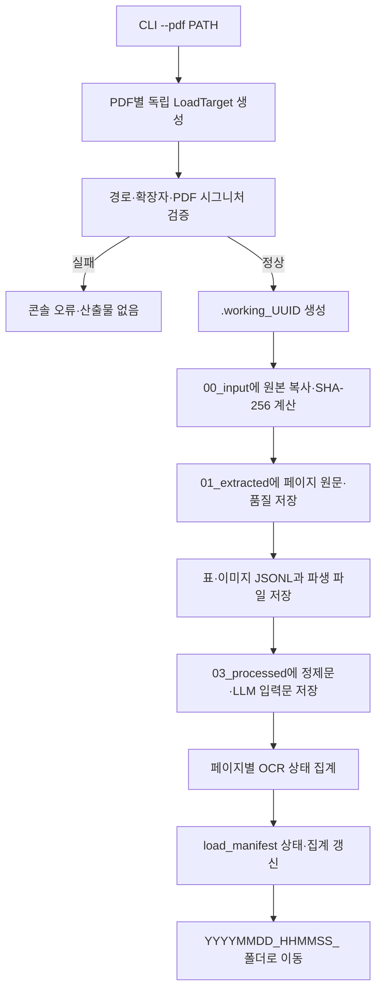

# PDF Load 산출물 설계 (schema·loader·parser v6)

## 1. 목표와 범위

PDF Load는 CLI에서 지정한 PDF를 PDF별 작업 폴더로 복사한 뒤, PDF에서 직접 추출한
원문과 후처리 결과를 단계별 파일 산출물로 보존하는 개발·검증 단계다.

```text
PDF
  → 00_input       입력 원본 보존
  → 01_extracted   PDF 직접 추출(원문·페이지 품질)
  → 02_tables      표 산출물(Markdown/XLSX/원본 영역 PNG)
  → 02_images      PDF 내장 이미지 산출물
  → 03_processed   정제문·LLM 입력문
  → 99_result      PDF 단위 결과·경고
```

현재 범위에는 DB 문서 선택, 문서 세트 구성, 실제 OCR 실행, LLM Profile·Detail 추출,
DB 적재를 포함하지 않는다. 표 추출 알고리즘과 다단 레이아웃 처리 방식도 이번 구조
개편에서는 변경하지 않는다. 이미지 추출 및 표 캡처는 원문 보존을 위한 산출물이며,
이미지 자체의 OCR·의미 분석은 수행하지 않는다.

## 2. 확정 정책

- 결과 루트는 `artifacts/load_test`다. `runs` 같은 실행 단위 하위 폴더는 사용하지 않는다.
- PDF 하나마다 `YYYYMMDD_HHMMSS_<PDF명>` 형식의 폴더를 만든다.
- 최종 폴더명에는 `PDF_` 접두사, 마이크로초, UUID, SHA-256 일부를 넣지 않는다.
- 같은 초에 같은 PDF명으로 생성된 폴더가 이미 있으면 덮어쓰지 않고 실패 처리한다.
- 여러 `--pdf` 입력은 서로 독립적으로 처리하며 하나가 실패해도 다른 PDF를 계속 처리한다.
- 작업 중에는 `.working_<UUID>` 폴더를 사용하고, 결과 저장이 끝난 뒤 최종 폴더명으로 이동한다.
- 기존 `artifacts/load_test` 결과는 이동·변환·삭제하지 않는다. 새 이름은 이후 Load부터 적용한다.
- `run_manifest.json`, `summary.json`, `errors.jsonl`, `load.log` 같은 실행 단위 기록은 만들지 않는다.
- PDF 단위의 원본·상태·집계·경로는 `99_result/load_manifest.json` 하나를 정본으로 사용한다.
- 페이지·표·이미지·경고 목록은 JSONL 정본으로 저장하고 TXT·MD·XLSX·PNG는 열람·검증용 파생 산출물로 정의한다.

## 3. CLI와 환경 설정

공개 CLI 옵션은 반복 지정 가능한 `--pdf` 하나다.

```powershell
python main.py load --pdf "C:\data\보험약관.pdf"
python main.py load --pdf "C:\data\약관.pdf" --pdf "C:\data\상품요약서.pdf"
```

헤더·푸터 제거는 기본 OFF이며 `.env`에서 제어한다.

```dotenv
PDF_LOAD_HEADER_FOOTER_ENABLED=false
```

운영체제 환경변수, 프로젝트 `.env`, 기본값 `false` 순서로 적용한다. `true/false`,
`1/0`, `on/off`, `yes/no`를 대소문자와 관계없이 지원하며 그 외 값은 파싱 전에
설정 오류로 처리한다. 기존 CLI 옵션과 표 추출 알고리즘은 유지한다.

## 4. PDF별 처리 흐름



복사 이후 오류가 발생하면 PDF 작업 폴더의 `99_result/load_manifest.json`에 `FAILED`
상태와 `error.stage`, `error.code`, `error.message`를 기록한다. 입력 검증 단계에서 실패한 경우에는 폴더를 만들지
않고 콘솔에만 오류를 출력한다.

최종 폴더 이동은 Windows의 일시적인 접근 거부·공유 위반에 한해 최대 5회 재시도한다.
재시도 간격은 0.1초, 0.2초, 0.4초, 0.8초다. rename 오류가 발생하더라도
`.working_<UUID>`가 사라지고 최종 폴더가 존재하면 이동이 완료된 것으로 판정한다.
이미 이동이 완료된 항목의 최종화 호출은 같은 최종 폴더를 반환하며, 작업 폴더와 최종
폴더가 동시에 존재하거나 둘 다 없으면 덮어쓰지 않고 실패 처리한다.

## 5. 산출물 저장 구조

```text
artifacts/load_test/
└── YYYYMMDD_HHMMSS_<PDF명>/
    ├── 00_input/
    │   └── 원본파일.pdf
    ├── 01_extracted/
    │   ├── pages.jsonl
    │   ├── raw_text.txt
    │   └── pages/
    │       └── page_XXXX.txt
    ├── 02_tables/
    │   ├── tables.jsonl
    │   ├── page_XXXX_table_XXX.md
    │   ├── page_XXXX_table_XXX.xlsx
    │   └── page_XXXX_table_XXX.png
    ├── 02_images/
    │   ├── images.jsonl
    │   └── page_XXXX_image_XXX.<ext>
    ├── 03_processed/
    │   ├── content.md
    │   ├── pages.jsonl
    │   ├── tables/
    │   │   ├── page_XXXX_table_XXX.md
    │   │   └── page_XXXX_table_XXX.response.json
    │   └── pages/
    │       └── page_XXXX.md
    ├── 90_debug/
    │   ├── cropped.pdf
    │   └── header_footer_analysis.json
    └── 99_result/
        ├── load_manifest.json
        └── warnings.jsonl
```

`02_images`에는 작은 장식성 이미지를 제외한 PDF 내장 이미지와 이미지 JSONL을
저장한다. 동일 바이트의 이미지는 SHA-256으로 중복 제거하고 이미지 레코드의
`occurrences`에 페이지·좌표를 기록한다. `90_debug/cropped.pdf`는 헤더·푸터 제거가 활성화되고 반복 문장이 실제 검출된 경우에만
생성한다. 모든 산출물 경로는 해당 PDF 폴더를 기준으로 한 상대경로로 기록한다.

기계 처리의 정본은 `load_manifest.json`과 각 JSONL이다. `raw_text.txt`, `content.md`,
페이지별 TXT·MD와 표 MD·XLSX·PNG는 정본으로부터 재생성 가능한 파생 산출물이다.

### 5.1 `00_input`: 입력 원본

Load 대상 PDF의 복사본을 보존한다. 입력 메타데이터는 `load_manifest.json.source`에 기록한다.

- `원본파일.pdf`: Load 시점에 복사한 PDF. 파서는 이 복사본을 사용한다.
- `source.source_path`: 수집 경로의 provenance 확인을 위한 원본 절대경로다. 산출물 내부 파일을
  찾을 때는 이 값을 사용하지 않고 항상 `copied_path`와 `artifacts`의 상대경로를 사용한다.

### 5.2 `01_extracted`: PDF 직접 추출 결과

PDF 라이브러리가 직접 반환한 값을 최대한 가공하지 않고 저장한다.

- `raw_text.txt`: 모든 페이지의 `text_raw`를 form-feed(`\f`)로만 구분한 원문.
- `pages/page_XXXX.txt`: 페이지별 `text_raw`를 가공 없이 저장한 UTF-8 원문.
- `pages.jsonl`: 페이지별 원문, 품질 지표, OCR 상태, 경고 및 원문 파일 경로.

`load_manifest.json.artifacts`에는 페이지별 파일 디렉터리를 다음과 같이 기록한다.

```json
{
  "raw_pages_dir": "01_extracted/pages",
  "processed_pages_dir": "03_processed/pages",
  "processed_tables_dir": "03_processed/tables"
}
```

`pages.jsonl`의 페이지 레코드는 다음 필드를 포함한다.

```json
{
  "page_no": 7,
  "text_raw": "PDF extract_text 결과",
  "text_raw_path": "01_extracted/pages/page_0007.txt",
  "meaningful_character_count": 8,
  "word_count": 2,
  "image_count": 1,
  "largest_image_area_ratio": 0.56,
  "page_status": "OCR_REQUIRED",
  "warnings": []
}
```

원문 페이지 JSONL에는 `table_refs`와 `image_refs`를 중복 저장하지 않는다. 두 참조는
LLM 입력과 함께 사용하는 `03_processed/pages.jsonl`에만 기록한다.

### 5.3 `02_images`: 이미지 추출 결과

PDF 내장 이미지를 저장한다. 표 원본 영역 PNG는 `02_tables`에서 별도로 관리한다.

- `images.jsonl`: 이미지 하나당 한 줄에 이미지 ID, 페이지·좌표, 추출 방식, 크기,
  SHA-256과 `occurrences`를 기록한다.
- `page_XXXX_image_XXX.<ext>`: 실제 내장 이미지 파일. `extraction_mode`는
  `EMBEDDED`로 기록한다.
- 가로·세로 중 짧은 쪽이 64px 미만이거나 표시 면적이 페이지의 0.5% 미만인
  장식성 객체는 저장하지 않는다. 동일 바이트가 여러 위치에 나타나면 실제
  파일은 하나만 만들고 manifest의 `occurrences`에 모든 위치를 기록한다.
- `03_processed/pages.jsonl`의 `image_refs`는 해당 페이지 이미지 ID 목록이며,
  `load_manifest.json.summary.image_count`는 물리 이미지 수를 뜻한다.
- 후처리 페이지 JSONL과 페이지 Markdown에는 이미지 참조를 페이지 내 좌표순으로
  결합한다. Markdown에는 `> 이미지 참조: <image_id> (<상대경로>)` 형식의 명시적
  참조를 넣으며 원문 텍스트를 덮어쓰지 않는다.
- 좌표순은 `(bbox.top, bbox.left, bbox.bottom, bbox.right)`이며, 중복 이미지의
  `occurrences`는 페이지 번호를 먼저 비교한 뒤 같은 좌표 기준으로 정렬한다.
- 본문·표·이미지를 합친 페이지 Markdown도 Y 좌표 후 X 좌표 순서를 사용한다.

유의미성 판정을 통과해 MD/XLSX가 생성된 표는 원본 PDF의 bbox 영역을
`02_tables/page_XXXX_table_XXX.png`로 캡처하고 `tables.jsonl` 레코드의
`files.png`에 상대경로를 기록한다. MD나 XLSX를 이미지로 다시 그리지 않으며,
표 경계선이 잘리지 않도록 bbox 바깥에 2pt 여백을 추가한 뒤 페이지 범위로 제한한다.
캡처는 PDF 좌표 기준 2배 배율로 렌더링해 글자를 확대 확인할 수 있게 한다. 중첩 표가
독립적인 2차원 행·열 구조를 가지면 바깥 표 전체 PNG와 내부 표 상세 PNG를 모두 저장한다.
바깥 표 내용에 이미 포함된 1차원 라벨 조각은 중복 후보로 제외한다.
표 렌더용 PyMuPDF 문서는 PDF당 한 번만 열고 모든 표를 처리한 뒤 닫는다. 개별 표의
렌더링 실패는 해당 표의 `TABLE_RENDER_FAILED`로만 기록하며 다음 표 처리를 계속한다.

`images.jsonl`의 기본 레코드는 다음과 같다. 한 줄이 하나의 JSON 객체이며,
`image_path`는 PDF 폴더 기준 상대경로이고
`occurrences`에는 같은 바이트가 발견된 모든 페이지·좌표를 기록한다.

```jsonl
{"image_id":"page_0001_image_001","image_path":"02_images/page_0001_image_001.png","extraction_mode":"EMBEDDED","sha256":"…","pixel_width":1200,"pixel_height":800,"occurrences":[{"page_no":1,"bbox":[72,110,272,250]},{"page_no":2,"bbox":[72,110,272,250]}]}
```

후처리 페이지 `pages.jsonl`의 `image_refs`는 위 `image_id`를 페이지 내 좌표순으로 나열하며,
`load_manifest.json.summary.image_count`는 중복 occurrence가 아닌 물리 파일
수로 기록한다. `table_image_count`는 표를 렌더링해 만든 PNG 수를 별도로
기록한다. `03_processed/pages/page_XXXX.md`에는 위 명시적 참조 문장을 같은 좌표순으로
삽입한다.

### 5.4 `02_tables`: 표 추출 결과

표 후보를 유의미성 판정한 뒤 통과한 결과만 페이지·표 번호별 Markdown, XLSX, PNG로 저장한다.

- Markdown은 사람이 확인하거나 LLM 입력을 만들 때 사용한다.
- XLSX는 행·열 구조를 직접 확인할 때 사용한다.
- PNG는 병합 셀·중첩 표·원본 레이아웃을 확인하거나 멀티모달 LLM 입력을 만들 때 사용한다.
- `tables.jsonl`에는 표 하나당 한 줄로 페이지 번호, 표 번호, 좌표, 행·열 수와
  `quality_status`, `quality_reason`, `files.markdown`, `files.xlsx`, `files.png`,
  `files.processed_markdown`
  상대경로를 기록한다.
- 페이지 크기는 `01_extracted/pages.jsonl`에 이미 있으므로 표 레코드에는 반복하지 않는다.
- `reconstruction`은 모든 저장 표에 기록하며 `SUCCEEDED`, `FALLBACK`,
  `PASSTHROUGH_DISABLED`, `SKIPPED_NOT_MEANINGFUL` 상태를 구분한다.
- 실제 LLM을 호출한 표는 모든 호출 시도의 공급자 원본 응답을
  `03_processed/tables/<table_id>.response.json`에 기록한다.
- PNG 생성에 실패하면 `files.png`는 `null`로 두고 페이지 경고에
  `TABLE_RENDER_FAILED`를 기록하며 나머지 Load는 계속한다.

표 판정은 LLM을 호출하지 않는 결정 규칙으로 수행하며 상태는 다음과 같다.

- `MEANINGFUL`: 2개 이상 열 사이에 항목·값 관계가 있거나 여러 행이 같은 구조를
  반복하는 표. 숫자가 없어도 Key-Value, 질문·답변, 긴 설명 대응 구조는 포함한다.
- `FRAGMENT`: 1행 숫자·금액·비율 데이터, 1열 내용 조각 또는 페이지 하단의 헤더처럼
  앞뒤 페이지와 병합될 가능성이 있는 후보. 정보 손실을 피하기 위해 표 산출물로 보존한다.
- `REJECTED`: 빈 표, 유효 셀이 하나뿐인 제목·안내 박스, 모든 셀이 사전에 정의한
  공통 헤더 라벨인 1행 헤더, 같은 영역에서 반복 검출된 동일 표. 숫자 없는 1행
  Key-Value와 `암/뇌/치아`, `A/B/C` 같은 짧은 1열 목록은 `FRAGMENT`로 보존한다.
  1열 후보가 유의미한 상위 표 안에 있고 정규화한 전체 내용도 상위 표에 포함될 때만
  `NESTED_TEXT_DUPLICATE`로 제외한다.

`REJECTED` 후보는 표 bbox 목록과 페이지 `table_refs`에 넣지 않으며 MD/XLSX/PNG도
생성하지 않는다. 따라서 해당 영역의 글자는 일반 본문 추출에 남는다. 제외 내역은
`warnings.jsonl`에 `TABLE_CANDIDATE_REJECTED`와 사유, 페이지, 후보 순번, bbox,
행·열·유효 셀 등의 최소 지표로 기록한다. 저장되는 표 번호는 제외 후보 때문에 중간 번호가
비지 않도록 페이지별로 다시 부여한다.

PDF 텍스트 레이어가 없는 스캔·벡터 영역은 제외 후 일반 텍스트로 복구할 내용이 없으므로
현재는 경고만 남는다. 실제 OCR 엔진이 추가되면 이 경우의 이미지 fallback을 별도 계약으로
연결한다. `detected_table_count`는 `table.extract()`에 성공해 판정까지 도달한 후보 수이며,
추출 예외는 `TABLE_EXTRACTION_FAILED` 경고로 별도 기록한다.

PDF 표 셀에는 화면에 보이지 않는 제어문자가 포함될 수 있다. 표 Markdown과 XLSX를
만들 때만 XML 1.0에서 금지하는 `U+0000~U+0008`, `U+000B`, `U+000C`,
`U+000E~U+001F`를 제거한다. 탭, 줄바꿈, 캐리지리턴은 유지하며 `text_raw`와
`raw_text.txt`에는 이 정제를 적용하지 않는다.

제어문자를 제거한 경우 `warnings.jsonl`에
`TABLE_ILLEGAL_CONTROL_CHARACTERS_REMOVED` 경고를 기록한다. 경고에는 페이지 번호,
표 ID·순번, 제거된 전체 문자 수와 영향을 받은 셀의 1-based 행·열·제거 개수를 넣고,
셀 원문이나 제거된 문자 자체는 기록하지 않는다.

### 5.5 `03_processed`: 후처리·LLM 입력

원문과 표를 정제·결합한 결과를 저장하며, 향후 LLM 추출은 이 폴더를 기본 입력으로
사용한다.

- `pages/page_XXXX.md`: 페이지별 `content_markdown`을 저장한 LLM 입력용 Markdown.
- `pages.jsonl`: 페이지별 `text_content`, `content_markdown`, 표·이미지 참조와 Markdown 파일 경로.
- `content.md`: 전체 페이지의 `content_markdown`을 순서대로 결합한 문서.
- `tables/page_XXXX_table_XXX.md`: LLM 성공 결과 또는 원본을 사용한 표별 최종 Markdown.
- `tables/page_XXXX_table_XXX.response.json`: 최초 요청과 재시도를 포함한 공급자 원본 응답.

`MEANINGFUL` 표는 페이지·표 순서대로 한 번에 하나씩 LLM에 전달한다. 중첩 표이거나
빈 셀 비율이 25% 이상이거나 최장 셀이 120자 이상이면 제목·불릿 기반
`STRUCTURED_MARKDOWN`, 나머지는 `MARKDOWN_TABLE`을 요구한다. 응답은 코드 펜스·형식과
숫자·금액·기간·백분율 토큰을 검증하며 한 번 재시도한 뒤에도 실패하면 원본 Markdown으로
대체한다. `FRAGMENT`와 기능 OFF 표도 원본을 표별 최종 경로에 원자 저장한다.

응답 JSON은 공급자 응답 객체의 필드 구조를 유지해 `attempts[].response`에 보존한다. JSON이 아닌
본문은 `response_raw`에 기록한다. 요청에 사용한 이미지 base64, API 키와 Authorization
헤더가 공급자 응답에 되돌아온 경우 해당 값만 마스킹한다. 독립적인 중첩 표는 각각 호출·저장하되 `contained_by`를 기록하고,
페이지 Markdown에는 최상위 바깥 표만 넣는다. 페이지 간 또는 동일 헤더 표는 자동 병합하지 않는다.

`content_markdown`에 표를 결합할 때는 본문과 표 사이에 빈 줄 하나를 두며, 표 앞뒤에
이미 존재하는 줄바꿈은 정규화해 빈 줄이 중복되지 않도록 한다.

텍스트 계약은 다음과 같다.

```json
{
  "text_raw": "PDF extract_text 원문",
  "text_content": "헤더·푸터와 표 영역을 제외한 본문",
  "content_markdown": "본문과 표를 위치순으로 결합한 LLM 입력문",
  "content_markdown_path": "03_processed/pages/page_0007.md"
}
```

페이지 원문의 기계 처리 기준본은 `01_extracted/pages.jsonl`, 페이지별 열람본은
`01_extracted/pages/`에 보존한다. 후처리 페이지의 기계 처리 기준본은
`03_processed/pages.jsonl`, 열람본은 `03_processed/pages/`에 둔다.
헤더·푸터 처리와 표 결합은 `text_content`와 `content_markdown`에만 반영한다.

### 5.6 `90_debug`: 개발 검증용 결과

정상 LLM 입력이나 DB 적재에 직접 사용하지 않는 디버그 자료를 저장한다.

- `cropped.pdf`: 헤더·푸터 제거 결과를 시각적으로 확인하기 위한 PDF.
- `header_footer_analysis.json`: 페이지별 후보·정규화 문장·좌표·일치 페이지 수·제거 여부.

### 5.7 `99_result`: PDF 단위 최종 결과

- `load_manifest.json`: schema·loader·parser 버전, `artifact_id`, 생성·완료 시각,
  원본 메타데이터, 최종 상태, 페이지·표·이미지 집계, 산출물 상대경로와 오류의 단일 정본.
- `warnings.jsonl`: PDF 단위 경고를 한 줄에 하나씩 기록한다. 경고가 없으면 0바이트 파일이다.

경고의 `code`는 예외 내용과 관계없이 고정값으로 유지한다. 페이지·표·후보 순번과
예외 메시지는 `page_no`, `table_index`, `candidate_index`, `message` 필드로 분리한다.
`01_extracted/pages.jsonl`의 페이지별 `warnings`는 호환성을 위해 고정 코드 문자열
목록으로 유지한다.

```jsonl
{"code":"TABLE_EXTRACTION_FAILED","page_no":10,"candidate_index":3,"message":"…"}
{"code":"TABLE_RENDER_FAILED","page_no":10,"table_index":2,"candidate_index":3,"message":"…"}
```

복사와 검증이 끝나면 먼저 `status=RUNNING` manifest를 원자 저장한다. 파싱 산출물 저장 후
`summary`와 경로를 갱신하고, 완료 시 최종 상태와 `completed_at`을 기록한다. 성공·부분 성공은
`error=null`, 실패는 다음 구조를 사용한다.

```json
{"error":{"stage":"SAVE_ARTIFACTS","code":"OSError","message":"…"}}
```

최종 폴더 이동이 실제로 완료된 것이 확인되면 기존 `SUCCEEDED`, `PARTIAL`,
`OCR_REQUIRED` 결과를 `FAILED`로 덮어쓰지 않는다. 제한된 재시도 후에도 작업 폴더가
이동되지 않은 경우에만 `FINALIZE_ARTIFACTS` 실패로 기록한다.

### 5.8 표 LLM 재구성 설정

```dotenv
PDF_LOAD_TABLE_RECONSTRUCTION_ENABLED=true
LLM_BASE_URL=https://gemma4-31b-mtp.proxy.ainexus.ktcloud.com/v1
LLM_MODEL=gemma-4-31B-it
LLM_API_KEY=
LLM_REQUEST_TIMEOUT_SECONDS=120
LLM_MAX_OUTPUT_TOKENS=8192
```

개발용 `.env`에서는 ON으로 사용하고 `.env.example`은 OFF를 기본값으로 둔다. ON일 때만
URL과 모델을 필수 검증하고 API 키는 선택적으로 Authorization 헤더에 사용한다. OFF이면
HTTP 클라이언트를 만들지 않으며 원본 표를 그대로 후처리 표와 페이지 Markdown에 사용한다.
LLM fallback이 하나라도 발생하면 해당 PDF 상태는 `PARTIAL`이다.

## 6. 헤더·푸터 처리

### OFF (`PDF_LOAD_HEADER_FOOTER_ENABLED=false`)

- 상·하단 문장을 정제문에서도 제거하지 않는다.
- OCR 품질 판정용 반복 문장 검출은 수행하고, 판정 문자 수에서만 제외한다.
- `header_footer_analysis.json`에는 `enabled=false`, `applied=false`를 기록한다.
- `90_debug/cropped.pdf`는 생성하지 않는다.

### ON (`PDF_LOAD_HEADER_FOOTER_ENABLED=true`)

다음 조건을 모두 충족한 실제 반복 문장만 `text_content`와 `content_markdown`에서
제외한다.

- 문서가 3페이지 이상이다.
- 페이지 상단·하단 10% 영역에 있는 후보 문장이다.
- 공백·유니코드를 정규화하고 페이지 번호처럼 변하는 숫자 토큰을 제외해 비교한다.
- 최소 3개 페이지, 전체 페이지의 80% 이상에서 반복된다.

반복 문장이 없으면 상·하단 영역을 기본 비율로 임의 제거하지 않는다. 원문
`text_raw`와 `raw_text.txt`에는 어떤 경우에도 제거 결과를 반영하지 않는다.

## 7. 페이지 품질과 문서 상태

페이지별로 의미 있는 한글·영문·숫자 문자 수, 단어 수, 이미지 수, 가장 큰 이미지의
면적 비율을 기록한다.

- `meaningful_character_count`: 반복 헤더·푸터와 정상 추출된 표 영역의 중복 본문을
  제외하고 OCR 판정에 실제 사용한 문자 수.
- `OCR_REQUIRED`: 텍스트 추출이 실패했거나, 사용 가능한 표 없이 의미 있는 문자가
  10자 이하이고 가장 큰 이미지가 페이지의 50% 이상.
- `EMPTY`: 의미 있는 문자·사용 가능한 표·큰 이미지가 모두 없음.
- `TEXT`: 위 조건 이외.

정상 추출된 표가 하나라도 있으면 표 자체를 사용 가능한 구조 데이터로 인정한다.

문서 상태는 페이지 상태를 집계해 결정한다.

```text
FAILED       입력 복사 또는 PDF 파싱 중단
OCR_REQUIRED 사용 가능한 TEXT 없이 OCR 대상이 존재하거나 추출 가능한 텍스트가 없음
PARTIAL      TEXT와 OCR 대상이 섞였거나 핵심 표·이미지 추출 경고가 존재
SUCCEEDED    그 외 정상 처리
```

문서를 `PARTIAL`로 낮추는 핵심 경고는 `TABLE_DETECTION_FAILED`,
`TABLE_EXTRACTION_FAILED`, `IMAGE_EXTRACTION_UNAVAILABLE`, `IMAGE_DETECTION_FAILED`,
`IMAGE_EXTRACTION_FAILED`, `TABLE_RECONSTRUCTION_FALLBACK`이다. `TABLE_RENDER_FAILED`, `CROPPED_PDF_FAILED`,
`CROPPED_PDF_UNAVAILABLE`, `TABLE_ILLEGAL_CONTROL_CHARACTERS_REMOVED`는 경고를
기록하지만 상태를 낮추지 않는다.

`load_manifest.json.summary`에는 `ocr_required_pages`, `empty_pages`,
`page_status_counts`를 기록한다. 모든 PDF가 `SUCCEEDED`일 때만 CLI 종료 코드는 0이며,
`PARTIAL`·`OCR_REQUIRED`·`FAILED`가 하나라도 있으면 1이다.

## 8. 버전·호환성

번호 기반 디렉터리와 raw/processed JSONL 분리는 Load 산출물 계약 v2에서 도입했고,
v2.1에서는 페이지별 TXT·Markdown 파일과 JSONL 경로 필드를 추가했다. v3에서는
중복이 큰 후처리 TXT와 `chunks.jsonl`을 제거하고 페이지 Markdown만 유지한다. v4에서는
내장 이미지와 중첩·복잡 표의 선택적 캡처를 추가했다. v4.1에서는 MD/XLSX가 생성되는
모든 표에 원본 PDF 영역 PNG를 추가한다.
v5에서는 `source_manifest.json`, `document.json`, `load_result.json`을
`99_result/load_manifest.json`으로 통합하고, 표·이미지·경고 목록을 JSONL로 변경했다.
원문 페이지 JSONL의 표·이미지 참조 중복과 표 레코드의 페이지 크기·빈 재구성 필드도 제거했다.
v5.1에서는 OCR 판정 기준, 핵심 추출 경고의 상태 반영, 이미지 좌표순 정렬과 문서 단위
표 렌더러를 추가하되 JSON 형식은 바꾸지 않는다. v5.2에서는 표 후보 유의미성 판정과
검출·저장·조각·제외 집계를 추가한다. v6에서는 유효 표의 순차 멀티모달 LLM 재구성,
표별 최종 Markdown, 모든 호출 시도의 공급자 원본 응답 JSON과 중첩 표 중복 제거를 추가한다.
신규 산출물의 `schema_version`은 `pdf-load-v6`, `versions.loader`는 `pdf-loader-v6`,
`versions.parser`는 `prosure-pdf2md-v6`로 기록한다. 기존 v2·v2.1·v3·v4·v4.1·v5·v5.1·v5.2 산출물은 읽기·비교용으로
보존하며 자동 마이그레이션하지 않는다. 실제 청킹과 이미지 OCR은 별도 단계로 추가한다.

## 9. 완료 기준

- PDF 단위 최상위 폴더 안에 번호 기반 일곱 영역이 생성된다.
- 원본 PDF SHA-256, 원문, 정제문, 표 Markdown/XLSX와 결과·경고가 보존된다.
- 내장 이미지 JSONL·파일과 유의미하거나 조각으로 판정된 표의 JSONL·원본 영역 PNG가 보존된다.
- `load_manifest.json` 하나만 원본·상태·집계·산출물 경로를 소유한다.
- 원문 `pages.jsonl`에는 표·이미지 참조가 없고 후처리 `pages.jsonl`에만 존재한다.
- 실행 단위 manifest·summary·errors·log는 생성되지 않는다.
- 헤더·푸터 OFF/ON과 OCR 페이지 상태가 계약대로 동작한다.
- 표 후보의 검출·저장·조각·제외 수와 제외 사유가 추적 가능하고, 제외 텍스트는 본문에 남는다.
- 모든 저장 표의 최종 Markdown이 `03_processed/tables`에 존재하고, LLM 호출 표는 모든
  시도의 공급자 응답 JSON을 함께 보존한다.
- 유효 표는 순차 호출되며 중첩 표의 내부 결과는 보존하되 페이지 Markdown에는 중복 삽입하지 않는다.
- 같은 초·같은 PDF명의 기존 폴더를 덮어쓰지 않는다.
- 입력 검증 실패는 산출물을 남기지 않고, 복사 이후 실패는 PDF 단위 결과를 남긴다.
- 기존 수집 CLI와 다단 레이아웃 동작은 변하지 않는다.

## 10. 추후 진행

- 무선 표·병합 셀·여러 페이지에 걸친 연속 표 처리
- 헤더 자동 추론 및 표 원본 셀 JSON 보존
- 2단 문서의 열 구분과 읽기 순서 개선
- 스캔 페이지를 위한 실제 OCR 엔진 연동
- PDF별 subprocess timeout 및 강제 종료를 통한 오류 격리
- DB 문서 목록 연동과 LLM 기반 Product Profile·Detail 추출
